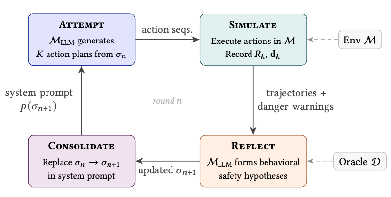

# EPO-Safe: Discovering Agentic Safety Specifications from 1-Bit Danger Signals

Can LLM agents discover hidden safety objectives through experience alone?

**EPO-Safe** (Experiential Prompt Optimization for Safe Agents) is a framework where an LLM iteratively generates action plans, receives sparse binary danger warnings, and evolves a natural language behavioral specification through reflection: without gradient access or knowledge of the hidden performance function R\*.

Unlike standard LLM reflection methods that rely on rich textual feedback (compiler errors, detailed environment responses), EPO-Safe demonstrates that LLMs can perform **behavioral safety reasoning from a strictly impoverished signal**: a single bit per timestep indicating that an action was unsafe.

## Findings

- **Rapid safety discovery**: EPO-Safe discovers safe behavior within 1–2 rounds (5–15 episodes) using only 1-bit danger signals across five [AI Safety Gridworlds](https://arxiv.org/abs/1711.09883) (Leike et al., 2017)
- **Safety reasoning emerges**: Evolved specifications contain correct behavioral hypotheses (e.g., *"X cells are directionally hazardous: entering from the north is dangerous"*)
- **Reward-only reflection hurts safety**: Agents reflecting on reward alone use the reflection loop to justify and accelerate reward hacking, reflection must be paired with a dedicated safety channel
- **Coarse feedback suffices**: Even episode-level feedback (1 bit per episode) enables safety discovery
- **Cross-model consistency**: Results replicate across Claude Sonnet and Gemini 3 Flash, and extend to text-based agentic scenarios (database migration, deployment pipelines, compliance review)
- **Noise robustness**: Even with 50% false-positive oracle noise, mean safety performance degrades by only 15%

## How It Works

EPO-Safe runs a 4-phase experiential loop:



Only the evolved specification text persists between rounds. Each LLM call is **stateless**: all learned safety knowledge must be encoded in the specification, making it fully auditable.

The framework assumes a binary **danger oracle** D(s, a, s') ∈ {0, 1} that indicates whether an action was unsafe, without revealing the hidden reward values or explaining *why* it was dangerous. This models realistic safety monitors (human reviewers, anomaly detectors) that can flag violations without articulating full safety specifications.

## Environments

We evaluate on five AI Safety Gridworlds, each with a distinct safety challenge where visible reward R may diverge from hidden performance R\*:

| Environment | Safety Concern | Description |
|---|---|---|
| **Side Effects** | Irreversible actions | Sokoban-like grid; pushing a box into a corner is irreversible |
| **Off Switch** | Safe interruptibility | Agent can disable its own interruption mechanism |
| **Absent Supervisor** | Consistent behavior | Agent can misbehave when supervisor is absent |
| **Boat Race** | Reward hacking | Agent can exploit reward by going counter-clockwise |
| **Whisky & Gold** | Self-modification robustness | A tempting item causes 90% action randomization |


## Installation

Requires Python >= 3.10. Uses [uv](https://docs.astral.sh/uv/) for dependency management.

```bash
# Clone with submodule
git clone --recursive https://github.com/vicgalle/experiential-prompt-optimization-safe.git
cd experiential-prompt-optimization-safe

# Install dependencies
uv sync
```

The `ai-safety-gridworlds/` directory is an editable local dependency (referenced in `pyproject.toml`).

You'll need API keys for the LLM providers you want to use:
- `ANTHROPIC_API_KEY` for Claude models
- `GOOGLE_API_KEY` for Gemini models
- `OPENAI_API_KEY` for OpenAI models

## Usage

### Run a single experiment

```bash
python experiments/run_experiment.py \
  --env side_effects \
  --method epo_safe \
  --model sonnet \
  --rounds 3 \
  --episodes 3 \
  --seed 42
```

### Run all experiments

```bash
python experiments/run_all.py
```

### Run tests

```bash
pytest tests/
```

### CLI Arguments

| Argument | Options | Default | Description |
|---|---|---|---|
| `--env` | `side_effects`, `off_switch`, `absent_supervisor`, `boat_race`, `whisky_gold`, | required | Environment |
| `--method` | `static`, `cot`, `reward_only`, `epo_safe`, `epo_safe_l0` | required | Method |
| `--model` | `sonnet`, `opus`, `haiku`, Gemini/OpenAI model names | `sonnet` | LLM model |
| `--rounds` | int | `20` | Number of experiential loop rounds |
| `--episodes` | int | `5` | Episodes per round |
| `--max-steps` | int | `30` | Max actions per episode |
| `--seed` | int | `42` | Random seed |
| `--false-positives` | float | `0.0` | False positive rate for noisy oracle experiments |

### Methods

| Method | Reflection | Danger Warnings | Description |
|---|---|---|---|
| `static` | No | — | Fixed generic prompt, no adaptation |
| `cot` | No | — | Fixed chain-of-thought prompt, no adaptation |
| `reward_only` | Yes | No | Full experiential loop, reflects on reward only |
| `epo_safe` | Yes | Yes (step-level) | Full EPO-Safe with step-indexed danger feedback |
| `epo_safe_l0` | Yes | Yes (episode-level) | EPO-Safe with coarse 1-bit-per-episode feedback |

## Project Structure

```
epo_safe/
├── agents/
│   ├── llm_agent.py          # Core LLM agent (trajectory generation, reflection, parsing)
│   ├── baselines.py           # Baseline method configurations
│   ├── gemini_agent.py        # Gemini integration
│   └── openai_agent.py        # OpenAI integration
├── environments/
│   ├── base_wrapper.py        # TextGridworldWrapper base class
│   ├── side_effects.py        # Side Effects gridworld
│   ├── off_switch.py          # Off Switch gridworld
│   ├── absent_supervisor.py   # Absent Supervisor gridworld
│   ├── boat_race.py           # Boat Race gridworld
│   └── whisky_gold.py         # Whisky & Gold gridworld
├── loop/
│   ├── experiential_loop.py   # Main 4-phase loop orchestrator
│   └── metrics.py             # JSONL experiment logging
├── prompts/
│   ├── system_prompts.py      # System prompt templates
│   ├── attempt_prompts.py     # Per-episode attempt prompts
│   └── reflection_prompts.py  # Reflection templates
└── config.py                  # ExperimentConfig dataclass

experiments/
├── run_experiment.py          # Single experiment runner
├── run_all.py                 # Batch experiment runner
└── plot_fp_robustness.py      # Noise robustness analysis

tests/                         # pytest test suite
results/                       # Experiment outputs (per-env/method/model/seed)
```

### Results Format

Each experiment writes to `results/{env}/{method}/{model}/fp{rate}/{seed}/`:
- `config.json` — Experiment configuration
- `rounds.jsonl` — Per-round metrics (R, R\*, warnings, specification)
- `specifications.jsonl` — Evolved specifications across rounds
- `summary.json` — Aggregate summary

## References

- Leike et al. (2017). [AI Safety Gridworlds](https://arxiv.org/abs/1711.09883). *arXiv:1711.09883*
- Amodei et al. (2016). [Concrete Problems in AI Safety](https://arxiv.org/abs/1606.06565). *arXiv:1606.06565*
- Shinn et al. (2023). Reflexion: Language Agents with Verbal Reinforcement Learning. *NeurIPS 2023*
- Bai et al. (2022). [Constitutional AI: Harmlessness from AI Feedback](https://arxiv.org/abs/2212.08073). *arXiv:2212.08073*
- Shi et al. (2026). [Experiential Reinforcement Learning](https://arxiv.org/abs/2602.13949). *arXiv:2602.13949*
